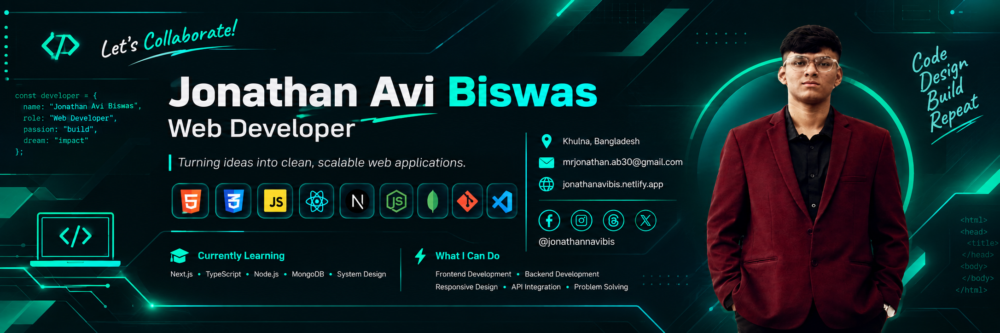

  

<h1 align="center">
  Hi 👋, I'm Jonathan Avi Biswas
</h1>

  <strong>Web Developer</strong> • Bangladesh 🇧🇩

  Building responsive, modern and user-friendly web experiences.

---

## 👨‍💻 About Me

I'm **Jonathan Avi Biswas**, a web developer focused on building
responsive and modern web applications.

I'm continuously improving my skills and exploring modern
web development technologies.

- 💻 Web Development
- 🌐 Responsive Web Design
- ⚛️ React Development
- 📘 TypeScript
- 🚀 Next.js
- 🟢 Node.js
- 🔧 Git & GitHub

---

## 🛠️ Skills

### Frontend

  HTML5 • CSS3 • JavaScript • TypeScript • React • Next.js

### Backend

  Node.js

### Tools

  Git • GitHub • VS Code

---

## 📚 Currently Learning

- Advanced React
- Next.js
- TypeScript
- Node.js
- Modern Full-Stack Development

---

## 🌐 Connect With Me

📍 **Location:** Khulna, Bangladesh

📧 **Email:**  
mrjonathan.ab30@gmail.com

🌐 **Portfolio:**  
https://jonathanavibis.netlify.app/

🔵 **Facebook:**  
https://www.facebook.com/jonathanavibis

🟣 **Instagram:**  
https://www.instagram.com/jonathanavibis

⚫ **Threads:**  
https://www.threads.com/@jonathanavibis

---

## 🚀 Portfolio

  <a href="https://jonathanavibis.netlify.app/">
    <strong>Visit My Portfolio →</strong>
  </a>

