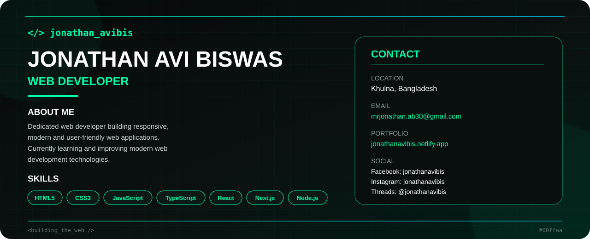

  

  

---

### 🚀 About Me

- 🎓 **Currently Learning:** Full-Stack Web Development with modern AI integrations  
- 🤖 **Focus Area:** Building responsive, AI-powered web applications & scalable web solutions  
- 💬 **Ask me about:** React, Next.js, modern UI design, and JavaScript  
- ⚡ *Always open to learning emerging web technologies and building smart solutions!*

---

### 🛠️ Tech Stack & Tools

**Frontend & Styling**  

**Backend & APIs**  

**AI & Workflow**  

**Tools & Platforms**  

